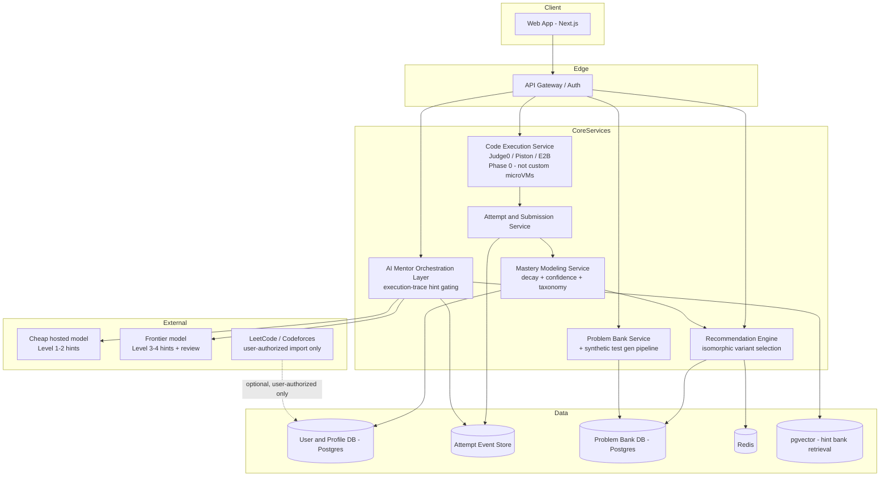

# Product Requirements Document: AlgoMentor AI

**Version:** 0.3
**Status:** Draft for review
**Supersedes:** v0.2 — this version corrects MVP infra scope (sandbox build-vs-buy), adds unit economics, a named competitive threat model, execution-traced hint design, problem-bank quality tooling, and a concrete monetization structure.

**Open assumption:** target user for the first 100 users was not finalized. This draft assumes **active job-seekers broadly** (campus placement + job switchers) as the Phase 0 B2C wedge, with a B2B pilot sequenced into Phase 2. Revisit Section 4/16 if this should narrow.

---

## 1. Vision

AlgoMentor AI is an AI-powered DSA learning platform that acts as a persistent personal mentor rather than a static problem archive. It combines an online coding judge with an AI layer that teaches through execution-aware guided reasoning, tracks per-user topic mastery over time with decay, and adapts what a learner practices next.

**One-line positioning:** most platforms help you solve more problems; AlgoMentor helps you become a better problem solver, and remembers how you learn.

**Core commercial reality this PRD is built around:** coding platforms with custom execution run on thin margins, and technical-interview prep is an episodic, high-churn category. Every architecture and pricing decision below is made with those two constraints in mind, not just the pedagogy.

---

## 2. Problem Statement

- DSA platforms are largely stateless: they know *what* you solved, not *why* you struggled or how understanding changes over time.
- AI hint features elsewhere are either static or, when LLM-based, leak full solutions the moment a user rephrases a prompt.
- No adaptive curriculum — users self-select problems inefficiently.
- No accounting for forgetting — no reinforcement schedule.
- No cross-platform continuity of learning history.
- **The real competitive threat isn't another platform — it's a user with LeetCode open in one tab and ChatGPT/Claude open in another**, bypassing any in-product hint gating entirely (see Section 6).

---

## 3. Goals & Non-Goals

**Goals**
- Coding judge with secure sandboxed execution, built on proven third-party infra first (not custom microVMs at MVP).
- Execution-trace-aware AI mentorship — hints grounded in actual failing variable state, not just static code guesses.
- Per-user, per-topic mastery model with decay and confidence intervals.
- Adaptive recommendation using isomorphic problem variants, not repeats.
- Unit economics that hold at a $20–35/mo consumer price point.
- A monetization structure that survives episodic 6–12 week prep cycles and high churn.

**Non-Goals (initially)**
- Building custom Firecracker/gVisor orchestration in-house (deferred — see Section 7).
- Full 300+ problem bank parity with incumbents at launch — start with a curated ~75-problem core-pattern set (Blind-75-style).
- Automated cross-platform scraping (deferred to V2/stretch, user-authorized import only).

---

## 4. Target Users / Personas

| Persona | Core need |
|---|---|
| University student (campus placement) | Structured pattern-by-pattern learning, confidence building, cost-sensitive |
| Experienced engineer (job switcher) | Fast, high-leverage prep in a 6–12 week window; will pay more, churns faster |
| Competitive programmer | Rating-appropriate problems, contest simulation |
| Bootcamp / university (B2B, Phase 2+) | Cohort-level visibility into collective weak areas |

*Phase 0 assumption: both individual personas are served by the same product surface; pricing/tier differentiation (Section 15) handles the difference rather than separate product lines.*

---

## 5. Feasibility Overview

| Component | Technical Feasibility | Commercial Viability | Primary Risk |
|---|---|---|---|
| Sandboxed Judge | High (proven tech exists) | Medium (fixed infra cost) | Operational overhead if self-built too early |
| Execution-Traced Hint Ladder | High (stateful orchestration) | High (core hook) | Latency from added context/trace processing |
| Decay / Mastery Model | High (adapted SM-2) | Medium | Data sparsity / cold start |
| Problem Bank (curated core set) | Medium (content-heavy) | High (defensible asset) | Test-suite edge-case debt |
| Unit Economics | High, if not 100% frontier-model-dependent | Low, if 100% frontier-model-dependent | Cyclical prep churn compounding CAC |

---

## 6. The Real Competitor: The Second Monitor

The primary competitive threat is not LeetCode Premium — it's **LeetCode (or AlgoMentor) plus a second window with a general-purpose LLM**. A frustrated or tired user will simply paste their code elsewhere and ask for the direct fix, defeating any in-product Socratic gating.

**Countermeasures — value an external LLM cannot easily replicate:**
- **Execution-state-aware hints** (Section 8): pointing to the exact variable state at the point of failure, something a copy-pasted code snippet in a generic chat window doesn't have.
- **Visual execution/debugging** (tree/graph layout generated from the actual run trace) — a fundamentally in-product experience.
- **One-click AST-level error classification** that's faster than the round-trip of copying code out and a fix back in.

This reframes the mentor's job: it isn't enough to be *resistant to jailbreaking* — it has to be **faster and more precise than tab-switching**, or gating is cosmetic.

---

## 7. Sandbox Infrastructure: Build vs. Buy (Corrected)

**Previous plan (v0.2) called for dedicated Firecracker/gVisor infrastructure at MVP. This is corrected here.**

Building a multi-language, multi-tenant microVM orchestrator from scratch — snapshotting, warm-pool sizing, memory reclamation, per-language runtime images — can consume the majority of early engineering time for a benefit users won't perceive at low volume.

**Phase 0 decision:** use an existing sandboxing layer rather than self-hosting custom infra:
- **Judge0** (self-hosted, open-source, GPL-licensed) on a single large compute instance, or
- **Piston**, or
- **E2B** (managed, purpose-built for AI-driven code execution).

Trade-off to track: Judge0's isolation model (`isolate`, not microVMs) is less battle-tested against adversarial multi-tenant code than Firecracker — acceptable for MVP validation, but warrants a real security review (or migration to microVM-based infra) before scaling to a paying, adversarial-enough user base.

**Migrate to custom microVM infra only once execution volume makes third-party compute cost the dominant line item** — not before.

---

## 8. AI Mentor: Execution-Traced Hint Ladder

This replaces the purely code-and-metadata hint design from v0.2 with a stronger mechanic.

**Pipeline:**

```
[User Code + Problem Constraints]
               │
               ▼
[Execution Sandbox Runner] → Failed on input: [1,2,3,1], expected true
               │
       (Execution Trace)
               │
               ▼
[State Filter: extracts variable state at failure point]
               │
               ▼
[LLM Hint Orchestrator] → "Notice the value of 'visited' at index 2..."
```

**Why this matters:** an LLM reasoning only from static code guesses at what's wrong and produces generic advice. An LLM given the exact variable state at the failing line can ask a precise, targeted Socratic question without ever revealing the algorithm.

**Gated levels (unchanged principle from v0.2, now trace-informed):**
1. Clarifying question, informed by the failure trace but revealing no problem-specific logic.
2. Pattern nudge naming the technique family.
3. Structural hint / pseudocode skeleton.
4. Full walkthrough — gated behind attempt/time threshold or explicit opt-in, logged as "assisted," and followed by a required explain-back check.

**Structural enforcement, unchanged from v0.2:** gating lives in the orchestration layer, not in prompt instructions alone; output filtering screens for solution-adjacent content before it reaches low-hint-level users.

**Post-submission code review:** complexity analysis, style feedback, missed edge cases — generated after submission only, never mid-solve.

---

## 9. Mastery Model & Spaced Repetition (Refined)

Retains the decay/confidence design from v0.2, with one important correction:

- **Per-topic score** in [0,1], recency-weighted, updated per attempt.
- **Decay function** modeled on spaced-repetition scheduling (SM-2-adapted).
- **Confidence bands** based on sample size; cold-start users default to tag-frequency recommendations until ~15–20 logged attempts.
- **Mistake taxonomy** classifies failure type (off-by-one, wrong pattern, wrong complexity, edge case, syntax).
- **Hint-adjusted mastery:** heavy hint use marks a topic "seen," not "owned."

**Correction — isomorphic variants, not repeats:** resurfacing the *same* problem for spaced repetition only tests memory of the specific trick, not the underlying skill. Once a user has internalized "this is a monotonic stack problem," re-serving the identical problem is close to useless. **Store 2–3 structurally isomorphic variants per pattern** (e.g., for Monotonic Stack: *Daily Temperatures*, *Next Greater Element II*, *Stock Spanner* — same invariant, different skin) and serve a variant, not a repeat, on each spaced-repetition pass.

---

## 10. Problem Bank Quality: Synthetic Test Generation

Curating exhaustive hidden test cases is the hardest part of building a credible problem bank — an insufficient test suite lets a suboptimal O(n²) solution pass an O(n) problem, which directly corrupts the mastery model's signal.

**Ingestion pipeline per problem:**
1. Write a slow, obviously-correct brute-force reference solution.
2. Write the optimal reference solution.
3. Use property-based/fuzz testing (differential testing between the two) to generate inputs until an asymmetry or time-limit violation is found, then add that case to the hidden suite.

This should be a required gate before any problem ships to the live bank, not an optional polish step.

---

## 11. Unit Economics & LLM Cost Strategy

A single active user in a 90-minute, three-problem session can generate roughly:
- 15–25 compile/run requests,
- 6–10 hint-ladder interactions,
- 1–2 full post-submission reviews.

**Caution:** the following cost figures are informed estimates for planning purposes, not verified benchmarks — validate against current provider pricing before committing to a price point. If Level 3–4 hints and reviews run entirely on frontier models, a heavy daily user could plausibly cost somewhere in the $0.40–$0.80/day range in raw inference — which puts margins at risk against a $20–35/mo consumer price point if usage is high and retention is short.

**Cost-tiering strategy:**
- **Level 1 hints:** template/cheap-model based — largely pattern-matchable from problem metadata.
- **Level 2 hints:** cheap hosted small model (e.g., a GPT-4o-mini class model) with retrieval from a pre-written hint bank per tag.
- **Level 3–4 hints and code review:** frontier-class model, since these require real reasoning over the user's actual code and execution trace.
- **Cost-reduction path (post-MVP, not day one):** once volume justifies the ML engineering investment, fine-tune an open-weight code model (e.g., Qwen2.5-Coder-7B, DeepSeek-Coder) served via vLLM/Ollama on a dedicated GPU instance (A10G/L4-class), reserving frontier models strictly for Level 4 walkthroughs and complex diff explanations. This is sequenced *after* validating demand with cheaper hosted models, not before — fine-tuning is real engineering effort that shouldn't gate MVP launch.
- **Caching:** common explanations reused across users rather than regenerated per request.
- **Rate limits:** free tier capped on Level 3–4 hints/day.

---

## 12. Business Model Risk: Cyclical Churn

Technical interview prep is episodic by nature: users cram intensively for 6–12 weeks, land an outcome (offer or rejection), and cancel. Consumer interview-prep platforms are commonly understood to see very high churn in the months following an intensive prep cycle — treat any specific churn percentage as a planning assumption to validate with your own cohort data, not a fixed fact.

**Implication for SaaS metrics:** if CAC is high and LTV is capped at roughly 2–3 months of subscription revenue, the business needs either very low organic CAC (referral-driven growth, natural in a "did you get the job" viral loop) or a second, non-episodic revenue leg.

**Mitigation:** pair the B2C engine with a persistent B2B/institutional tier (Section 15) — bootcamps and university programs renew annually rather than churning post-interview, smoothing revenue that would otherwise be entirely seasonal.

---

## 13. Interview & Contest Prep Mode

Unchanged from v0.2: timed, hint-disabled at the API level (not just hidden in UI), full mentor debrief only after the session ends. This is an integrity requirement, not a UI toggle.

---

## 14. System Architecture (Revised)



---

## 15. Monetization & Packaging

| Dimension | Free / Freemium | Pro Candidate ($29/mo or $69/quarter) | B2B Cohort / University (Phase 2+) |
|---|---|---|---|
| Coding Sandbox | Standard limits, shared queue | Priority runner allocation | Dedicated runner pools |
| Hint Ladder | Unlimited L1–2; 3/day L3–4 | Unlimited L1–4 + AST-level analysis | Unlimited + instructor overrides |
| Mastery Engine | Basic topic radar ("seen vs. owned") | Full decay tracking + auto-curriculum | Cohort gap analytics, assignment builder |
| Mock Interview | None | 2 AI-conducted mocks/mo | Custom contest/assessment environment |
| Target | Early learners, casual practice | Active job seekers (30–90 day horizon) | Bootcamps, university labs, recruiters |

Pricing figures are a starting hypothesis, not a validated number — treat as an input to test rather than a commitment.

---

## 16. Phased Roadmap (Revised Sequencing)

**Phase 0 — MVP Validation**
- Sandbox: self-hosted Judge0 (or Piston/E2B) — no custom microVM infra.
- Problem bank: ~75 curated core-pattern problems (Blind-75-style), each passed through the synthetic test-generation gate.
- Hint ladder L1–2 on cheap hosted models; L3–4 on a frontier model, rate-limited on free tier.
- Basic mastery dashboard ("seen vs. owned").
- **Decision needed before this phase locks scope:** confirm target persona for first 100 users (Section 4) — affects problem selection (placement-style vs. FAANG-style) and initial pricing test.

**Phase 1 — Differentiation**
- Execution-trace context wired into the hint orchestrator.
- Full decay-based mastery model with isomorphic-variant spaced repetition.
- Difficulty auto-calibration (ELO-style).
- Visual execution/debugging trace rendering (second-monitor countermeasure).

**Phase 2 — Monetization & B2B**
- Interview simulation mode (hints disabled at API level).
- Cohort management for bootcamps/university programs — recurring revenue leg to offset B2C churn.
- Evaluate fine-tuned open-weight model deployment if hosted-model costs justify it.

**Phase 3 — Unified Profile (Stretch)**
- User-authorized LeetCode/Codeforces import (no scraping — see prior version's Section 10 rationale, unchanged).
- Cross-platform skill graph.

---

## 17. Success Metrics (KPIs)

- Mastery score improvement per topic over time; reduction in repeated mistake types.
- Hint-dependency ratio (L3–4 vs. L0–2 solves) trending down per topic over time.
- Weekly active practice streaks; spaced-repetition completion rate.
- Gross margin per active user (validate the $0.40–$0.80/day estimate against real usage).
- Post-outcome retention rate (how many users stay after landing/losing a job) — direct measure of the churn risk in Section 12.
- B2B: cohort mastery improvement, instructor dashboard adoption, annual renewal rate.

---

## 18. Risks Summary

| Risk | Mitigation |
|---|---|
| Self-built sandbox infra consumes MVP engineering budget | Use Judge0/Piston/E2B first; migrate to microVMs only at volume (Section 7) |
| Users bypass hints via external LLM ("second monitor") | Execution-trace hints, visual debugging, AST classification (Section 6, 8) |
| LLM cost exceeds subscription margin | Tiered models, caching, deferred fine-tuning (Section 11) |
| Weak test suites corrupt mastery scoring | Differential/fuzz testing gate before problems ship (Section 10) |
| Spaced repetition trains recall, not skill | Isomorphic variants, not repeats (Section 9) |
| Cyclical churn caps LTV | B2B recurring revenue leg (Section 12, 15) |
| Judge0 isolation weaker than microVMs at scale | Security review before scaling; migration path defined |

---

## 19. Open Questions

- Final target persona for first 100 users (Section 4/16) — still undecided.
- Exact free-vs-paid hint tier limits, to be tuned against real cost data once live.
- Consent/UX flow for user-authorized cross-platform import (Phase 3).
- Should the AI interviewer in Interview Mode be a distinct product surface from the practice mentor?
